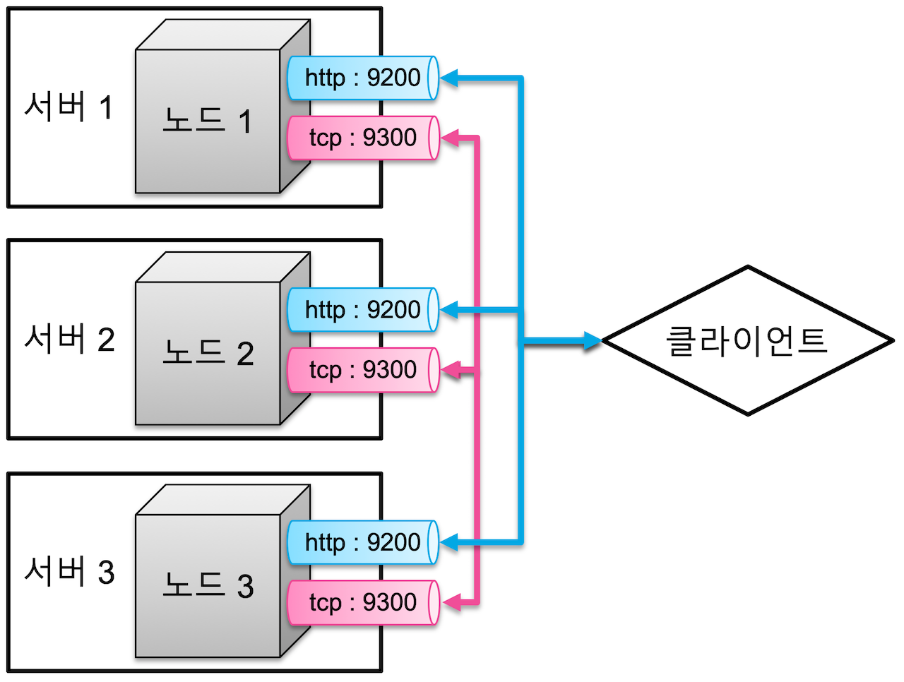
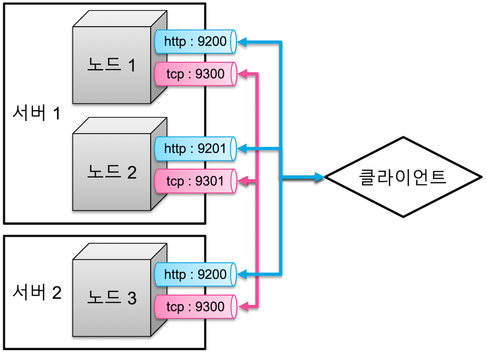
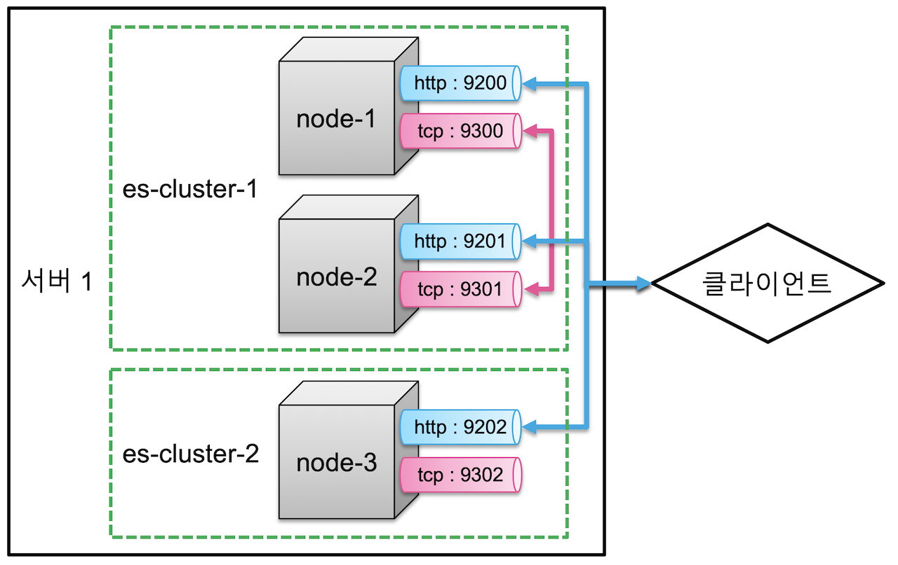

# Elasticsearch Study.03

`Elasticsearch` 는 대용량 데이터 처리를 위해 스케일 아웃과 데이터 무결성을 유지하기 위한 클러스터링을 지원한다.
클러스터는 항상 1개의 노드만 있어도 구성되며, 기본적인 동작을 한다.

`Elasticsearch` 의 시스템 구성이 어떻게 되는지 살펴보자

> 1. 클러스터 구성
> 2. 인덱스와 샤드 `Index & Shards`
> 3. 마스터 노드와 데이터 노드 `Master & Data Nodes`

---

## 클러스터 구성

`Elasticsearch` 는 클라이언트와 통신하기 위한 `HTTP` 통신과 노드 간의 데이터 공유를 위한 `TCP` 통신 총 2개의 네트워크 통신을 한다.

`HTTP` 통신을 위해 포트 `9200 ~ 9299` 사용하고, `TCP` 통신은 포트 `9300 ~ 9399` 사용한다.

기본적으로 클러스터는 하나의 물리 서버에 하나의 노드로만 구성하여 사용하는 것을 권장하지만,
`Elasticsearch` 의 클러스터를 구성할 때 다음과 같은 방식으로 구성할 수 있다.

1. 여러 서버에 하나의 클러스터 구성
2. 하나의 서버에 여려 클러스터 구성

---

## 여러 서버에 하나의 클러스터 구성

3개의 물리 서버가 각각 하나의 노드를 구성하고, 각 3개의 노드를 하나의 클러스터로 구성한 모습은 다음과 같다. 



하지만, 하나의 물리 서버 안에서 여러 개의 노드 구성이 가능하다. 이런 경우 각 노드 순서대로 포트가 `1`씩 증가하며 할당된다.



이렇게 물리 서버가 나눠져 있고, 각 서버의 노드 구성이 다를지라도 하나의 클러스터로 구성하기 위해서는 
각 노드 설정에서 `cluster.name` 를 동일하게 하면 가능하다.

반대로, 같은 서버에 있더라도 `cluster.name` 설정이 다르면 다른 클러스터로 구성된다.

---

## 하나의 서버에 여려 클러스터 구성

하나의 물리 서버에 3개의 노드를 실행시키고, 각 노드별로 클러스터는 각각 지정해주어 클러스터 구성을 다양하게 설정할 수 있다.

다음 예시는 `node-1, node-2, node-3` 의 노드 중 `node-1` 과 `node-2` 는 `es-cluster-1`, `node-3` 는 `es-cluster-2` 로 구성하여 실행시킨다.

```yaml
# node-1
cluster.name: es-cluster-1
node.name: "node-1"

# node-2
cluster.name: es-cluster-1
node.name: "node-2"

# node-3
cluster.name: es-cluster-2
node.name: "node-3"
```

위와 같은 구성을 하였을 때, 각 노드별 포트는 아래와 같다

|   Node   | Type | Port |
|:--------:|:----:|:----:|
| `node-1` | HTTP | 9200 |
| `node-1` | TCP  | 9300 |
| `node-2` | HTTP | 9201 |
| `node-2` | TCP  | 9301 |
| `node-3` | HTTP | 9202 |
| `node-3` | TCP  | 9302 |



---

#### 출처
- [Elastic 가이드북](https://esbook.kimjmin.net/)
- [Elasticsearch in Action](https://www.manning.com/books/elasticsearch-in-action)
