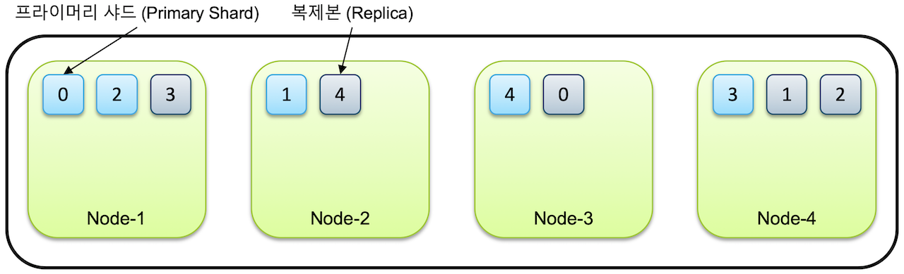

# Elasticsearch Study.03

`Elasticsearch` 는 대용량 데이터 처리를 위해 스케일 아웃과 데이터 무결성을 유지하기 위한 클러스터링을 지원한다.
클러스터는 항상 1개의 노드만 있어도 구성되며, 기본적인 동작을 한다.

`Elasticsearch` 의 시스템 구성이 어떻게 되는지 살펴보자

> 1. 클러스터 구성
> 2. 인덱스와 샤드 `Index & Shards`
> 3. 마스터 노드와 데이터 노드 `Master & Data Nodes`

---

## 클러스터 구성

`Elasticsearch` 는 클라이언트와 통신하기 위한 `HTTP` 통신과 노드 간의 데이터 공유를 위한 `TCP` 통신 총 2개의 네트워크 통신을 한다.

`HTTP` 통신을 위해 포트 `9200 ~ 9299` 사용하고, `TCP` 통신은 포트 `9300 ~ 9399` 사용한다.

기본적으로 클러스터는 하나의 물리 서버에 하나의 노드로만 구성하여 사용하는 것을 권장하지만,
`Elasticsearch` 의 클러스터를 구성할 때 다음과 같은 방식으로 구성할 수 있다.

1. 여러 서버에 하나의 클러스터 구성
2. 하나의 서버에 여려 클러스터 구성

---

### 여러 서버에 하나의 클러스터 구성

3개의 물리 서버가 각각 하나의 노드를 구성하고, 각 3개의 노드를 하나의 클러스터로 구성한 모습은 다음과 같다. 


하지만, 하나의 물리 서버 안에서 여러 개의 노드 구성이 가능하다. 이런 경우 각 노드 순서대로 포트가 `1`씩 증가하며 할당된다.


이렇게 물리 서버가 나눠져 있고, 각 서버의 노드 구성이 다를지라도 하나의 클러스터로 구성하기 위해서는 
각 노드 설정에서 `cluster.name` 를 동일하게 하면 가능하다.

반대로, 같은 서버에 있더라도 `cluster.name` 설정이 다르면 다른 클러스터로 구성된다.

---

### 하나의 서버에 여려 클러스터 구성

하나의 물리 서버에 3개의 노드를 실행시키고, 각 노드별로 클러스터는 각각 지정해주어 클러스터 구성을 다양하게 설정할 수 있다.

다음 예시는 `node-1, node-2, node-3` 의 노드 중 `node-1` 과 `node-2` 는 `es-cluster-1`, `node-3` 는 `es-cluster-2` 로 구성하여 실행시킨다.

```yaml
# node-1
cluster.name: es-cluster-1
node.name: "node-1"

# node-2
cluster.name: es-cluster-1
node.name: "node-2"

# node-3
cluster.name: es-cluster-2
node.name: "node-3"
```

위와 같은 설정을 하였을 때, 각 클러스터 구성과 포트 설정은 아래와 같다


---

## Discovery

노드가 처음 실행될 때 같은 서버, 또는 `discovery.seed_hosts: [ ]` 에 설정된 다른 노드를 찾아 하나의 클러스터로 바인딩하는 과정을 
**Discovery 디스커버리** 라고 한다. 

디스커버리가 되는 순서는 다음과 같다.

1. `discovery.seed_hosts` 설정된 주소 순서대로 노드 존재 여부 확인
   - 노드가 존재하는 경우, `cluster.name` 확인하여 일치하면 같은 클러스터로 바인딩, 아니면 다음 주소 확인 반복
   - 노드가 존재하지 않는 경우, 다음 주소 확인 반복
2. 주소가 끝날 때까지 노드를 찾지 못한 경우
   - 스스로 새로운 클러스터를 시작


> 클러스터에 노드가 많더라도 `discovery.seed_hosts` 설정은 노드 3 ~ 5 개 정도만 설정하면 충분히 클러스터가 바인딩 가능하다.
> 마스터 후보 노드들을 지정하게 되면 처음 탐색하는 대상 노드를 반드시 먼저 가동하고 있어야 한다.

---

## 인덱스와 샤드 - Index & Shards

`Elasticsearch` 에서 단일 데이터에 대한 명칭은 **인덱스 `Index`** 라고 한다.
(**인덱스**라는 명칭이 다양하게 사용되기도 하여서 *인덱시스 `Indices`* 라고도 표현한다.)

인덱스는 기본적으로 **샤드 `Shard`** 라는 단위로 분리되어 각 노드에 저장된다.
샤드는 루씬의 단일 검색 인스턴스이다.

하나의 인덱스가 5개의 샤드로 분리되어 하나의 노드에 저장되면 다음과 같다.


### Primary Shard & Replica

인덱스를 생성 시 별도 설정이 없다면, `7.0 버전` 부터는 **1개의 샤드로 인덱스가 구성**되며, `6.x 이하 버전` 에서는 **5개로 구성된다.**
클러스터에 노드를 추가하게 되면, 샤드가 각 노드에 분산되고 1개의 복사본이 기본적으로 생성된다.

처음에 생성된 샤드는 **Primary Shard**가 되고, 당연히 복제본은 **Replica Shard**가 된다.

예시로, 노드 4개가 있는 클러스터에 1개의 인덱스가 5개의 샤드로 구성된다면, 각 5개의 `Primary Shard` 와 5개의 `Replica Shard` 가 생성되는 것이다.



> 노드가 하나만 있다면, `Replica Shard` 는 생성되지 않고 `Primary Shard` 만 존재한다.<br>
> 그렇기 때문에 `Elasticsearch` 에서는 하나의 클러스터에 최소 3개의 노드를 구성하는 것을 권한다. 

`Replica Shard` 가 필요한 이유는, 당연히 하나의 노드에 장애가 발생한다고 하더라도 데이터의 유실없이 서비스 운영이 가능하기 때문이다.


처음에는 클러스터에서 먼저 노드의 장애가 복구될 때까지 기다린다. 하지만 노드가 복구되지 않늗다고 하면, 장애 노드에 있던 샤드를 다른 노드에 복제한다.

위 그림처럼 `Node-3` 장애로 인해 `Shard-0` 과 `Shard-4` 가 다른 노드에 하나씩만 남았다.
이런 경우 노드 복구를 기다린 후 복구되지 않으면, `Shard-0` 과 `Shard-4` 를 각각 `Node-2` 와 `Node-4` 에 추가 복제한다.

이런 데이터 분산 처리 방식을 통해서 `Elasticsearch` 에서는 장애에 대한 데이터 유실을 방지하고 있다.

> `Primary Shard` 가 유실되는 경우에는, 새로운 `Primary Shard` 를 생성하는 것이 아니라,
> 남아있는 `Replica Shard` 를 `Primary Shard` 로 전환하고, 다시 `Replica Shard` 를 생성한다.

---

> #### Shard 개수 설정<br>
> `Shard` 의 개수 설정은 인덱스 최초 생성할 때 지정이 가능하다.<br>
> `Primary Shard` 는 인덱스 처음 생성할 때만 가능하고, 인덱스를 재색인 하지 않는 이상 변경 불가능하다.<br>
> `Replica Shard` 는 추후에도 변경 가능하다.

---

#### 출처
- [김종민님 - Elastic 가이드북](https://esbook.kimjmin.net/)
- [Elasticsearch in Action](https://www.manning.com/books/elasticsearch-in-action)
