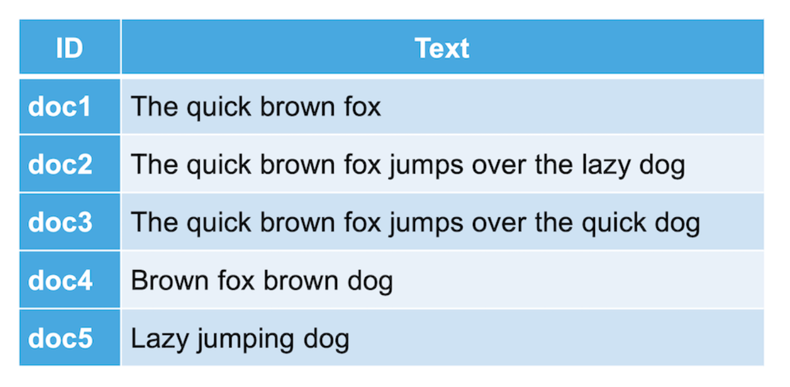
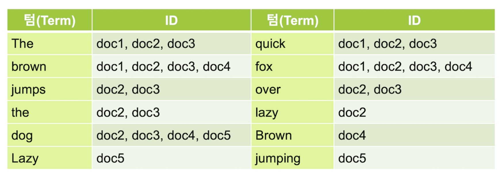
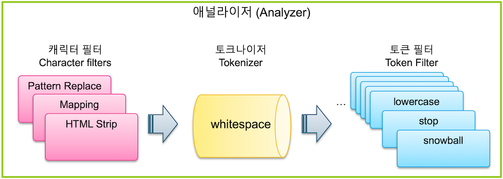

# Elasticsearch Study.06

`Elasticsearch` 에서 최적화 검색을 위해 데이터 원본 문서를 `Inverted Index` **역인덱스** 과정을 거친다.

역인덱스 과정은 텍스트 분석을 하는 애널라이저를 통해서 이뤄지며, 설정으로 검색 최적화 방식을 다양하게 처리 가능하다.

---

## Inverted Index 역인덱스

- `Inverted Index` **역인덱스** 는 주요 키워드가 어느 문서에 있는지 볼 수 있도록 분리하는 과정이라 할 수 있다.
- 역인덱스 과정을 거쳐 나온 각 키워드를 `Term` **텀** 이라고 부른다.

### 원본 문서

### 역인덱스 결과

---

## Text Analysis 텍스트 분석

- **역인덱스** 결과를 도출하기 위해 `Text Analysis` **텍스트 분석** 이라는 전체적인 과정을 거친다.
- **텍스트 분석** 이란 과정을 수행하는 기능을 `Analyzer` **애널라이저** 라고 한다.
- **애널라이저** 는 `Character Filter` **캐릭터 필터**, `Tokenizer` **토크나이저**, `Token Filter` **토큰 필터** 로 구성된다.

---

## Analyzer 애널라이저

---

#### 출처
- [김종민님 - Elastic 가이드북](https://esbook.kimjmin.net/)
    - `Elastic` 회사의 개발자이셨던 **김종민님의 `Elastic 가이드북`** 을 주로 참고하여 문서 작성 계획
- [Elasticsearch in Action](https://www.manning.com/books/elasticsearch-in-action)
