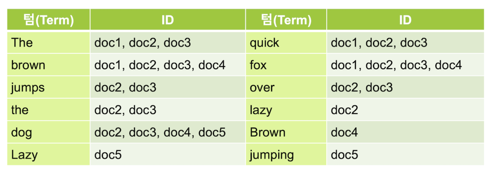
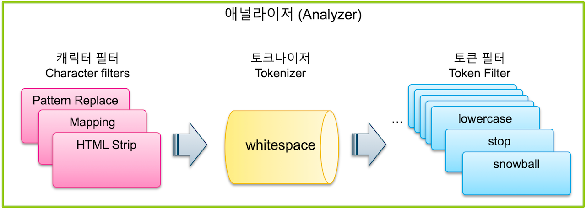

# Elasticsearch Study.06.01

`Elasticsearch` 에서 최적화 검색을 위해 데이터 원본 문서를 `Inverted Index` **역인덱스** 과정을 거친다.

역인덱스 과정은 텍스트 분석을 하는 애널라이저를 통해서 이뤄지며, 검색 최적화를 위해 `Elasticsearch` 에서는
다양한 설정을 지원하고, 처리 가능하다.

`Elasticsearch` 의 역인덱스 과정을 이해하기 위해서는 다음과 같은 개념들이 필요하다.

- `Inverted Index` **역인덱스**
- `Text Analysis` **텍스트 분석**
- `Analyzer` **애널라이저**
- `Character Filter` **캐릭터 필터**
- `Tokenizer` **토크나이저**
- `Token Filter` **토큰 필터**
- `Stemming` **형태소 분석**

---

## Inverted Index 역인덱스

- `Inverted Index` **역인덱스** 는 주요 키워드가 어느 문서에 있는지 볼 수 있도록 분리하는 과정이라 할 수 있다.
- 역인덱스 과정을 거쳐 나온 각 키워드를 `Term` **텀** 이라고 부른다.

#### 원본 문서


#### 역인덱스 결과



> **역인덱스** 과정을 거쳐 생성된 `Term` 은 역인덱스 검색 결과에 대해서만 관여한다.<br>
> **원본 문서는 변하지 않기 때문에, 검색 결과는 항상 원본 문서를 그대로 확인할 수 있다.**

---

## Text Analysis 텍스트 분석

- **역인덱스** 결과를 도출하기 위해 `Text Analysis` **텍스트 분석** 이라는 전체적인 과정을 거친다.
- **텍스트 분석** 이란 과정을 수행하는 기능을 `Analyzer` **애널라이저** 라고 한다.
- **애널라이저** 는 `Character Filter` **캐릭터 필터**, `Tokenizer` **토크나이저**, `Token Filter` **토큰 필터** 로 구성된다.

### 애널라이저 구성 요소

|         구분         | 개수        | 설명                               |
|:------------------:|:----------|----------------------------------|
| `Character Filter` | `0 ~ 3` 개 | 특정 문자를 대치하거나 제거 처리 과정 수행         |
|    `Tokenizer`     | `1` 개     | 단어를 `Term` 텀 단위로 하나씩 분리 처리 과정 수행 |
|   `Token Filter`   | `0 ~ N` 개 | 분리된 `Term` 텀을 하나씩 가공 처리 과정 수행    |




---

## Analyzer 애널라이저

`Elasticsearch` 는 텍스트 분석을 하기 위한 `Analyzer` **애널라이저**를 조합하고, 
그 동작을 확인할 수 있는 `API` 와 기능을 제공한다.

- `_analyze` API
- `term` Query
- Custom Analyzer
- `_termvectors` API

---

### `_analyze` API

- `_analyze` API 를 활용하면 `Analyzer` 애널라이저의 동작을 확인할 수 있다.
- `_analyze` API 요청에 입력된 **토크나이저** 와 **토큰 필터** 를 기반으로 텍스트 분석된 결과를 확인할 수 있다. 
- `tokenizer` 는 **토크나이저**로 `1`개만 입력, `filter` 는 **토큰필터**로 `N`개 입력 가능하다.
- `text` 로 입력된 요청 문장은 `token` 으로 분리되어 응답 정보에 포함된다.

##### Request

```json lines
GET _analyze
{
  "text": "The quick brown fox jumps over the lazy dog",
  "tokenizer": "whitespace",
  "filter": [
    "lowercase",
    "stop",
    "snowball"
  ]
}
```

##### Response

```json lines
{
  "tokens" : [
    {
      "token" : "quick",
      "start_offset" : 4,
      "end_offset" : 9,
      "type" : "word",
      "position" : 1
    },
    {
      "token" : "brown",
      "start_offset" : 10,
      "end_offset" : 15,
      "type" : "word",
      "position" : 2
    },
    {
      "token" : "fox",
      "start_offset" : 16,
      "end_offset" : 19,
      "type" : "word",
      "position" : 3
    },
    {
      "token" : "jump",
      "start_offset" : 20,
      "end_offset" : 25,
      "type" : "word",
      "position" : 4
    },
    {
      "token" : "over",
      "start_offset" : 26,
      "end_offset" : 30,
      "type" : "word",
      "position" : 5
    },
    {
      "token" : "lazi",
      "start_offset" : 35,
      "end_offset" : 39,
      "type" : "word",
      "position" : 7
    },
    {
      "token" : "dog",
      "start_offset" : 40,
      "end_offset" : 43,
      "type" : "word",
      "position" : 8
    }
  ]
}
```

#### 등록된 `Analyzer` 직접 활용한 `_analyze` API
- 위와 같이 **토크나이저** 와 **토큰필터** 를 직접 입력 지정하여 할 수도 있지만, `Elasticsearch` 에서 이미 등록된 **애널라이저** 를 이용하면 바로 사용 가능하다.<br>

##### Request

```json lines
GET _analyze
{
  "text": "The quick brown fox jumps over the lazy dog",
  "analyzer": "snowball"
}
```

##### Response

```json lines
{
  "tokens" : [
    {
      "token" : "the",
      "start_offset" : 0,
      "end_offset" : 3,
      "type" : "word",
      "position" : 0
    },
    // ...
    {
      "token" : "dog",
      "start_offset" : 40,
      "end_offset" : 43,
      "type" : "word",
      "position" : 8
    }
  ]
}
```

#### `Index` 인덱스에 `Analyzer`적용

- **인덱스** 에도 `mappings` 설정을 통해 **애널라이저** 를 적용할 수 있다.
- `analyzer` 요청 정보에 사용하고자 하는 **애널라이저** 를 지정한다.
- **애널라이저** 가 등록된 **인덱스** 에 데이터를 저장하면 **텍스트 분석** 과정을 거치게 된다.
- 그리고 **애널라이저** 기반의 생성된 `Term` **텀** 기준으로 데이터 검색이 가능하다.
  - `jumps` 또는 `jumping` 단어 모두 `jump` 로 텍스트 분석되기 때문에, 데이터 검색 시 `jumps`, `jumping`, `jump` 로 요청하여도 동일한 결과를 확인할 수 있다. 

##### 인덱스에 애널라이저 등록하는 방법
```json lines
PUT my_index2
{
  "mappings": {
    "properties": {
      "message": {
        "type": "text",
        "analyzer": "snowball"
      }
    }
  }
}
```

```json lines
GET my_index2/_search
{
  "query": {
    "match": {
      "message": "jumping"    // `jumps`, `jumping`, `jump` 입력하여 검색한 결과 모두 동일하다. 
    }
  }
}
```

---

### `term` Query

- `term` Query 질의 방식을 사용하면, `match` Query 질의 방식과 다르게 **애널라이저** 과정이 적요되지 않는다.
- 오로지 저장된 `Term` **텀** 을 기준으로 검색하게 된다.

```json lines
GET my_index2/_search
{
  "query": {
    "term": {
      "message": "jump"   // `jumps`, `jumping` 인 경우, 검색되지 않는다.
    }
  }
}
```

---

### Custom Analyzer

- `Index` **인덱스** 에 `Analyzer` **애널라이저** 를 지정할 때, **토크나이저** 와 **토큰필터** 를 조합하여 등록하는 경우가 많다.
- **애널라이저** 만 Custom 하는 것 뿐 아니라, **토큰필터** 도 Custom 하게 지정 가능하다.

#### `my_index` 인덱스에 `my_custom_analyzer` 애널라이저 등록

```json lines
PUT my_index
{
  "settings": {
    "index": {
      "analysis": {
        "analyzer": {
          "my_custom_analyzer": {
            "type": "custom",
            "tokenizer": "whitespace",
            "filter": [
              "lowercase",
              "stop",
              "snowball"
            ]
          }
        }
      }
    }
  }
}
```

#### `my_custom_analyzer` 애널라이저에 `my_stop_filter` 토큰 필터 적용

```json lines
PUT my_index3
{
  "settings": {
    "index": {
      "analysis": {
        "analyzer": {
          "my_custom_analyzer": {
            "type": "custom",
            "tokenizer": "whitespace",
            "filter": [
              "lowercase",
              "my_stop_filter",
              "snowball"
            ]
          }
        },
        "filter": {
          "my_stop_filter": {
            "type": "stop",
            "stopwords": [
              "brown"
            ]
          }
        }
      }
    }
  }
}
```

#### Custom 애널라이저를 바로 인덱스에 적용

- `settings.mappings.message` 필드에 지정하여 적용 가능하다.

```json lines
PUT my_index3
{
  "settings": {
    "index": {
      "analysis": {
        "analyzer": {
          "my_custom_analyzer": {
            "type": "custom",
            "tokenizer": "whitespace",
            "filter": [
              "lowercase",
              "my_stop_filter",
              "snowball"
            ]
          }
        },
        "filter": {
          "my_stop_filter": {
            "type": "stop",
            "stopwords": [
              "brown"
            ]
          }
        }
      }
    }
  },
  "mappings": {
    "properties": {
      "message": {
        "type": "text",
        "analyzer": "my_custom_analyzer"
      }
    }
  }
}
```

> **인덱스** 의 설정 정보를 변경하고자 할 때는 삭제 후 다시 생성해야 한다.

---

### `_termvectors` API

- 색인된 문서의 역인덱스된 내용을 확인할 때, `_termvectors` API 를 활용하면 된다.

##### Request

```json lines
GET my_index3/_termvectors/1?fields=message
```

##### Response

```json lines
{
  "_index" : "my_index3",
  "_type" : "_doc",
  "_id" : "1",
  "_version" : 1,
  "found" : true,
  "took" : 1,
  "term_vectors" : {
    "message" : {
      "field_statistics" : {
        "sum_doc_freq" : 7,
        "doc_count" : 1,
        "sum_ttf" : 8
      },
      "terms" : {
        "dog" : {
          "term_freq" : 1,
          "tokens" : [
            {
              "position" : 8,
              "start_offset" : 40,
              "end_offset" : 43
            }
          ]
        },
        // ...
        "the" : {
          "term_freq" : 2,
          "tokens" : [
            {
              "position" : 0,
              "start_offset" : 0,
              "end_offset" : 3
            },
            {
              "position" : 6,
              "start_offset" : 31,
              "end_offset" : 34
            }
          ]
        }
      }
    }
  }
}

```

---

`Analyzer` **애널라이저** 에 대해 구성과 애널라이저를 확인하는 방법 등을 살펴보았다.

애널라이저가 구성되는 `Character Filter` 캐릭터 필터, `Tokenizer` 토크나이저, `Token Filter` 토큰 필터 는 다음 장에서 좀 더 자세히 정리하도록 하겠다.

### [Elasticsearch Study.06.02](./06_study_es_02.md)

---

#### 출처
- [김종민님 - Elastic 가이드북](https://esbook.kimjmin.net/)
    - `Elastic` 회사의 개발자이셨던 **김종민님의 `Elastic 가이드북`** 을 주로 참고하여 문서 작성 계획
- [Elasticsearch in Action](https://www.manning.com/books/elasticsearch-in-action)
